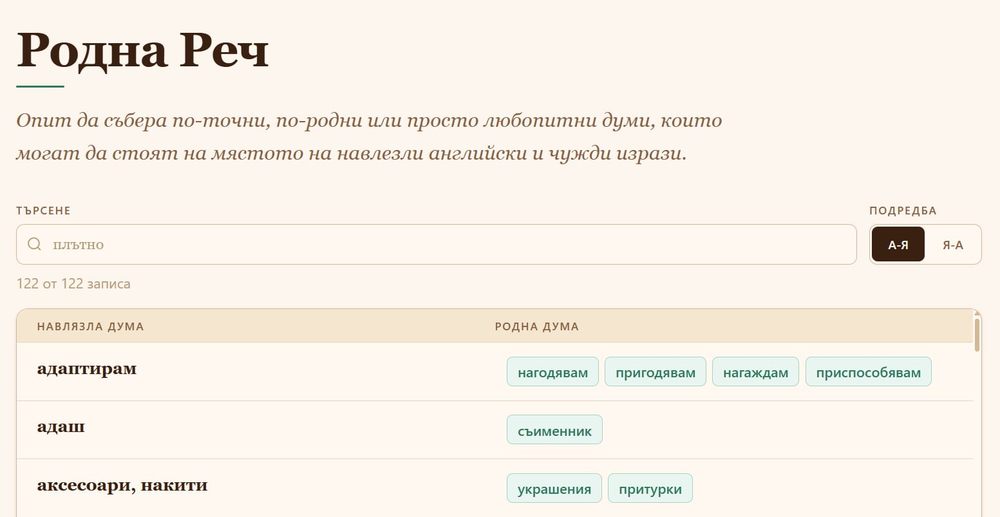
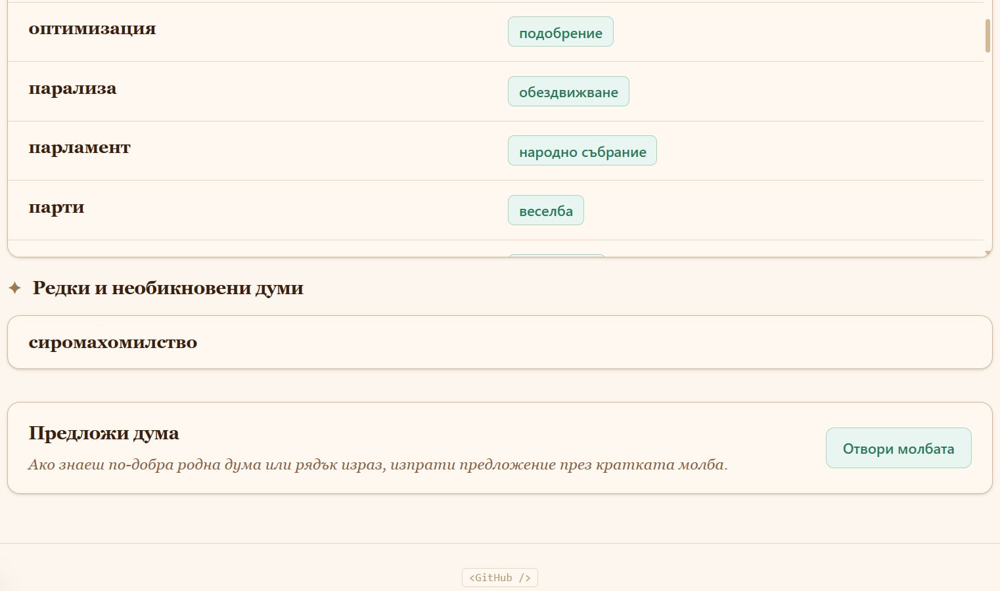

# Bulgarian Native Words

[bulgarian-native-words.vercel.app](https://bulgarian-native-words.vercel.app/)

**Rodna Rech** is a small personal dictionary for collecting Bulgarian native or Slavic alternatives to borrowed words and phrases.

The project started as a Notion list and is intentionally simple: the words are stored as static JSON and rendered as a searchable glossary.

The goal is not to prescribe perfect replacements for every borrowed word, but to keep a visible, editable collection of possible native words, older expressions, rare forms, and alternatives worth revisiting.

You can search the collection, sort the entries, browse rare words separately, and suggest new words through the linked Google Form in the app.

## Български

**Родна Реч** е малък личен речник за събиране на български родни или славянски алтернативи на навлезли чужди думи и изрази.

Проектът започва като списък в Notion и нарочно остава прост: думите се пазят като статичен JSON и се показват като речник с търсене.

Целта не е да се дават съвършени заместители на всяка чужда дума, а да има видим и лесен за поправяне сбор от възможни родни думи, по-стари изрази, редки форми и предложения, които си струва да се прегледат.

Можеш да търсиш в речника, да подреждаш записите, да разглеждаш редките думи отделно и да предложиш нова дума чрез свързаната Google молба в приложението.
