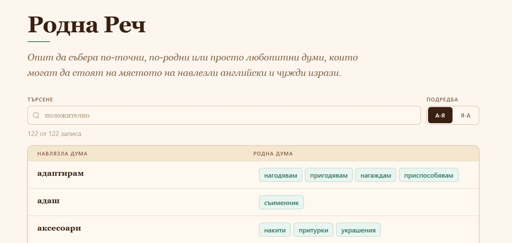

# Bulgarian Native Words

[bulgarian-native-words.vercel.app](https://bulgarian-native-words.vercel.app/)

**Rodna Rech** is a small personal dictionary for collecting Bulgarian native or Slavic alternatives to borrowed words and phrases.

The project started as a Notion list and is intentionally simple: the words are stored as static JSON and rendered as a searchable glossary.

## Български

**Родна Реч** е малък личен речник за събиране на български родни или славянски алтернативи на навлезли чужди думи и изрази.

Проектът започва като списък в Notion и нарочно остава прост: думите се пазят като статичен JSON и се показват като речник с търсене.
